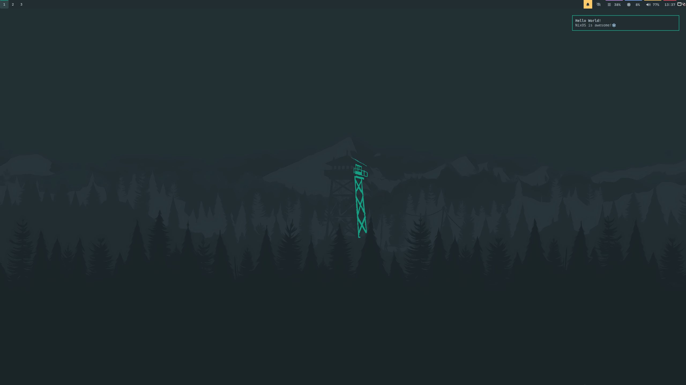
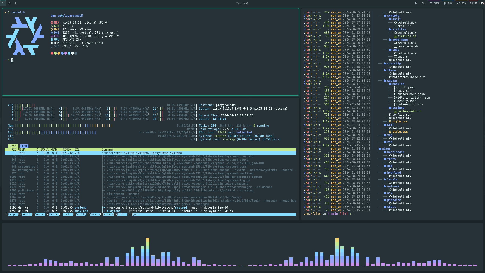
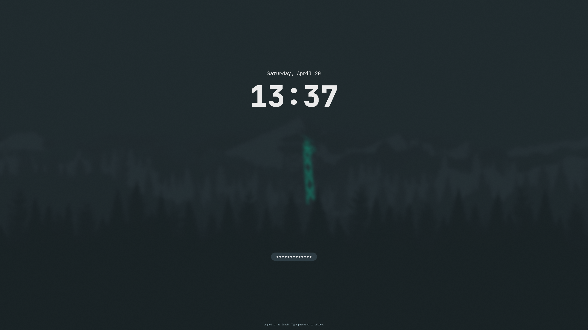

# NixFiles

My personal "dotfile" configurations for NixOS.

Under heavy construction, and probably not very useful for now.
I am still just playing around!

## 📚 Documentation

**Getting Started**
- [Installation Guide](docs/src/getting_started/install.md)

## 📸 Screenshots

## ⚖ License

This project is in the public domain - see the [LICENSE](LICENSE.md) for details.
